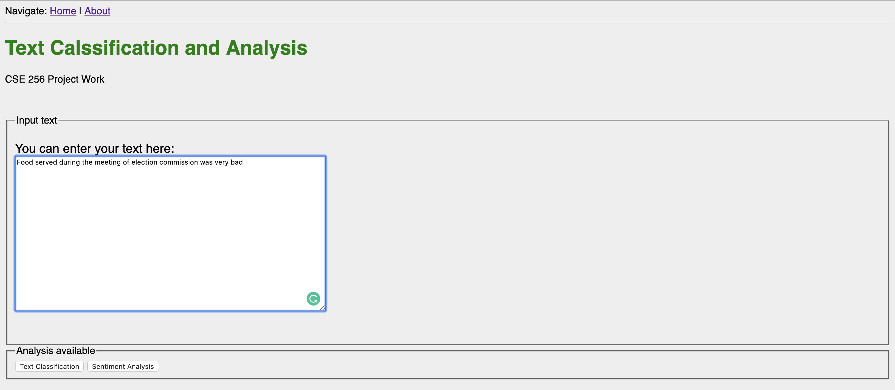
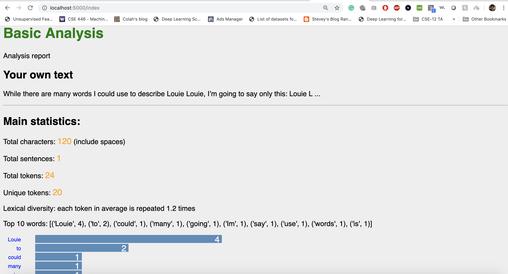
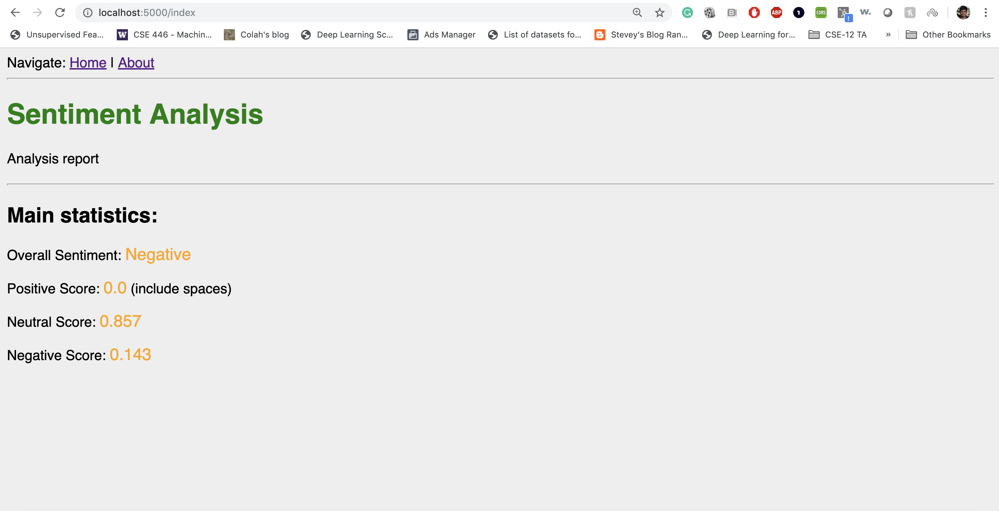

# Text Classification and Analysis

A flask (Python) Web Interface for Text classification (NLP).

## Key Features
There are two main features

#### Basic Analysis
* Tokenise a text
* Remove stop words (English, German, Italian dictionaries)
* Pre-process text (remove punctuation, lower case)
* Extract top words

#### Sentiment Analysis
* Shows if the text content is positive, neutral, negative
* Score for each sentiment

### Prerequisites

This app is built using **Python 3.6.6**

### Clone This Project

To clone and run this application, you'll need Git.

    # Clone this repository
    $ git clone https://github.com/amanrajdce/cse256-project.git

    # Open the folder and Install dependencies
    $ pip install requirements.txt

## Start Service
Now, to start the application, do the following:

    python run.py

Server will start and  you can connect by opening the web browser and connecting one of the URLs:

    http://localhost:5000

    http://localhost:5000/index

### More Screenshots
Basic Analysis

Sentiment analysis

