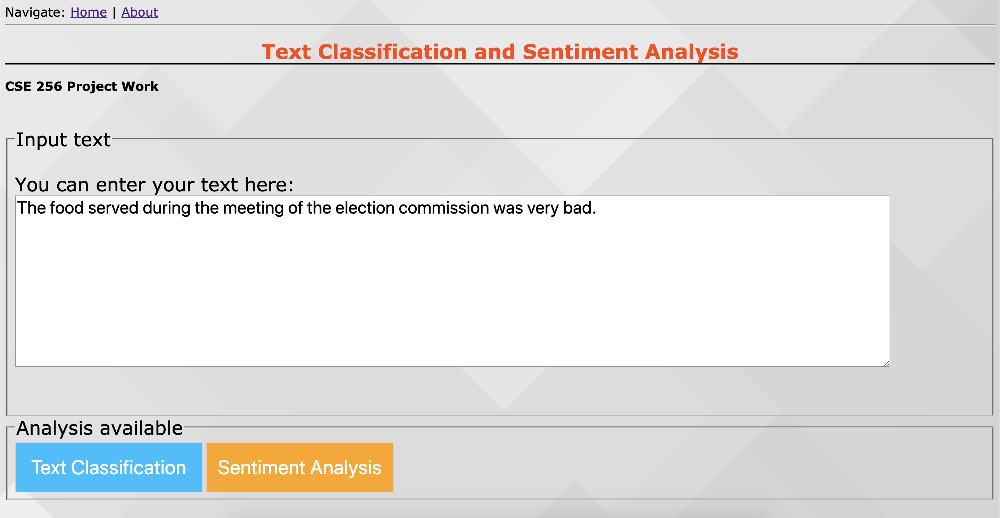
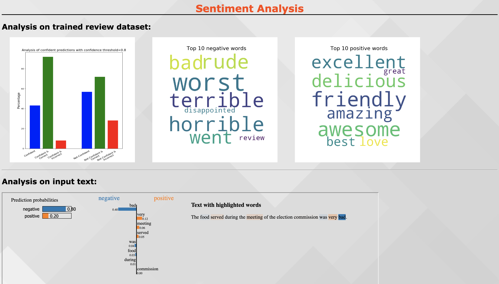

# Text Classification and Analysis

A flask (Python) Web Interface for Text classification (NLP).

## Key Features
There are two main features

#### Text Classification

#### Sentiment Analysis

### Prerequisites

This app is built using **Python 3.6.6**

### Clone This Project

To clone and run this application, you'll need Git.

    # Clone this repository
    $ git clone https://github.com/amanrajdce/cse256-project.git

    # Open the folder and Install dependencies
    $ pip install -r requirements.txt

## Start Service
Now, to start the application, do the following:

    python run.py

Server will start and  you can connect by opening the web browser and connecting one of the URLs:

    http://localhost:5000

    http://localhost:5000/index

### More Screenshots
Text Classification Analysis

Sentiment Analysis

### Acknowledgement
https://github.com/ravi3222/sentiment-analyzer007
